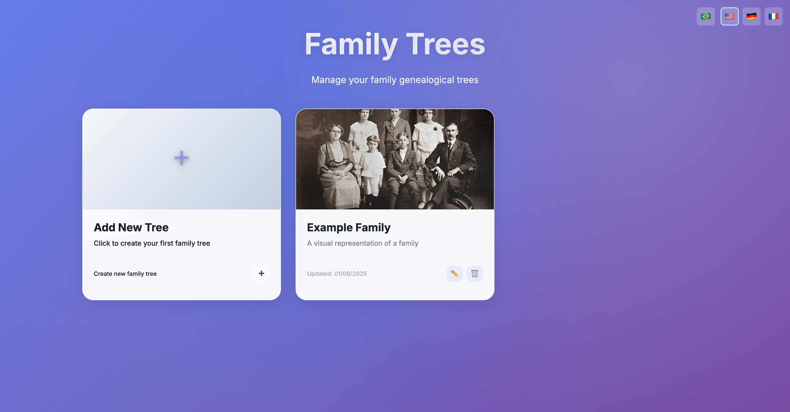

# Family Tree Project

This project is a dynamic and interactive family tree application that allows users to visualize and manage their family connections. It is built with PHP, JavaScript, and Tailwind CSS, and it features a clean, modern interface.

## 🌐 Live Demo

Try the application live at: **[https://family-tree.wasmer.app/](https://family-tree.wasmer.app/)**

## Features

- **Interactive Tree Views:** Switch between vertical and horizontal layouts to explore the family tree.
- **Dynamic Content:** Add, edit, and delete family members through an intuitive interface.
- **Multilingual Support:** The application supports 5 languages - Portuguese (🇧🇷), English (🇺🇸), German (🇩🇪), French (🇫🇷), and Estonian (🇪🇪).
- **Image Uploads:** Personalize each family member's card with a photo.
- **Editable Title and Subtitle:** Customize the main page text to match your family's identity.

## Screenshots

Here are a few screenshots of the application in action:

### Family Trees View


### Selected Tree View


## Getting Started

To get started with this project, you will need a local web server with PHP support.

1. **Clone the repository:**
   ```bash
   git clone https://github.com/your-username/family-tree.git
   ```

2. **Navigate to the project directory:**
   ```bash
   cd family-tree
   ```

3. **Start your local web server** and open the `index.php` file in your browser.

## Project Structure

- `index.php`: The main application file.
- `style.css`: Contains all the styles for the application.
- `data.json`: Stores the family tree data.
- `site_data.json`: Stores the editable title and subtitle.
- `images/photos.json`: Maps person names to their photo filenames.
- `add_person.php`, `edit_person.php`, `delete_person.php`: Back-end scripts for managing family members.
- `upload_image.php`, `delete_photo.php`, `get_photos.php`: Back-end scripts for handling image uploads.
- `update_text.php`: Back-end script for saving the editable text.

## Example Files

The project includes example JSON files to help you get started:

- `data.example.json`
- `site_data.example.json`
- `images/photos.example.json`
- `trees_example.json`

Copy these files to their corresponding non-example filenames (e.g., `data.json`) to start with a sample data set.

## How to Install and Run

1. **Prerequisites:**
   - A web server with PHP support (e.g., Apache, Nginx).
   - PHP 7.4 or higher.

2. **Installation:**
   - Clone this repository to your local machine or web server.
   - Ensure that the web server has write permissions to the `data.json`, `site_data.json`, and `images/photos.json` files, as well as the `images` directory.

3. **Running the Application:**
   - Open the `index.php` file in your web browser.
   - If you are starting with an empty `data.json` file, you will see a button to add the first person.
   - To start with a sample data set, copy the contents of the `.example.json` files to their corresponding non-example filenames.

## License

This project is licensed under the MIT License. See the [LICENSE](LICENSE) file for details.
